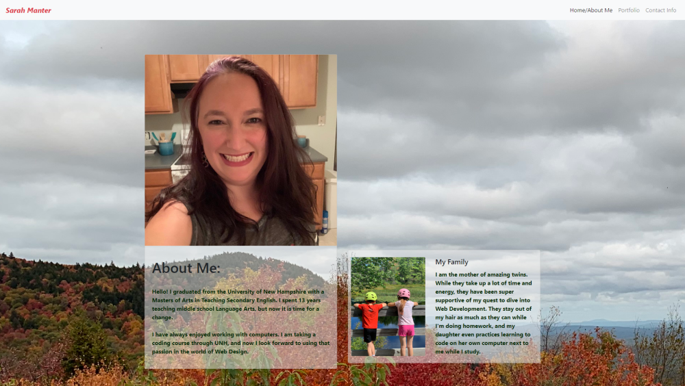
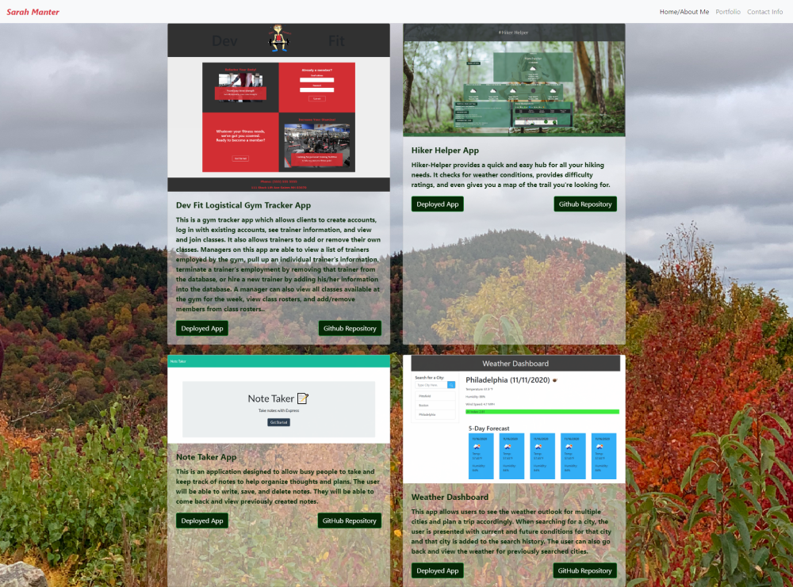
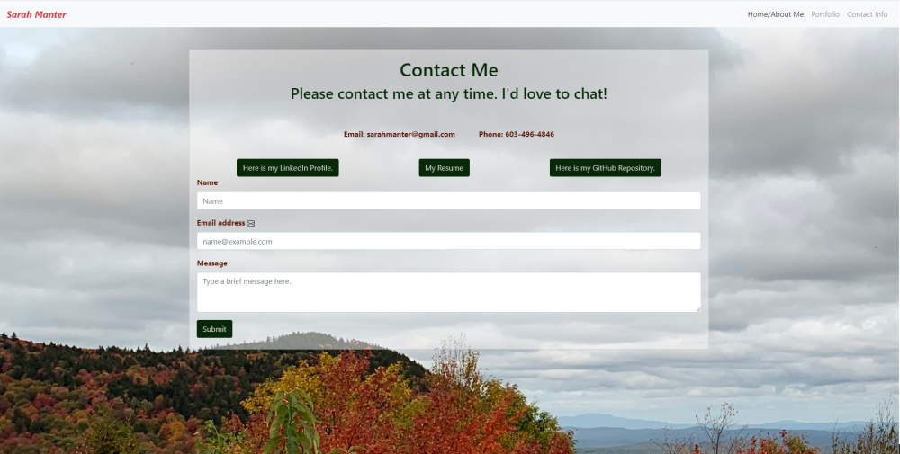

# ManterResponsivePortfolio

Sarah Manter's Responsive Portfolio

## Introduction

Hello!

I am currently taking a Coding Bootcamp Course in full-stack web development through UNH. I have been a middle school English teacher for 13 years, but I have always been passionate about working with computers and am looking forward to a change of careers. I am excited about the opportunity to use what I'm learning to turn ideas into usable products.

[Deployed Portfolio Site](https://smanter82.github.io/ManterResponsivePortfolio/)

## Table of Contents

- [Screenshots](#Screenshots)
- [Technologies](#Technologies)
- [Contact](#Contact)
- [Resume](#Resume)

## Screenshots

## Technologies

So far, I have learned to work with HTML, CSS, JavaScript, and JQuery, and I am now familiar with using AJAX calls to work with data from third-party API's. I'm also familiar with Node.js, Express, MySql, Sequelize, and MongoDB. I am looking forward to learning more about the back-end of web development and working with React.

## Contact

Contact me through GitHub or by email.

- [GitHub](https://github.com/smanter82)
- [LinkedIn](https://www.linkedin.com/in/sarah-manter-40881877/)
- Email: sarahmanter@gmail.com

## Resume

Resume: [PDF](./public/Assets/Sarah_Manter_Resume.pdf)
